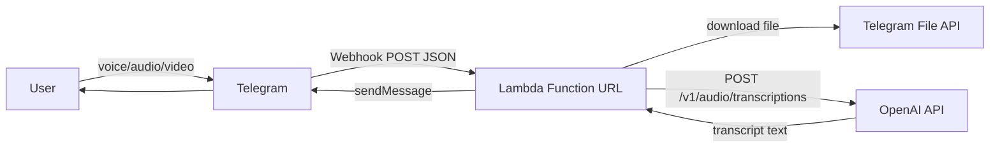

# Telegram Voice Transcriber Bot (AWS Lambda)

A serverless Telegram bot that transcribes voice messages, audio files, and videos using OpenAI's speech-to-text API.

- 🧠 Runs on **AWS Lambda** (Function URL)
- 📲 Triggered by **Telegram webhook**
- 🗣 Transcribes **voice messages, audio files & videos**
- 🔐 Private: only allowed users can use it (simple allowlist or password gate)
- 💸 Cheap: Lambda cost ~0, OpenAI billed per audio minute

---

## ✨ Features

- Forward or send a voice message, audio file, or video to the bot → get back transcribed text.
- Supports:
  - Telegram voice notes (`voice`)
  - Telegram audio files (`audio`)
  - Telegram videos (`video`)
  - Telegram video messages / video notes (`video_note`)
- Password / allowlist based access so random people can't burn your OpenAI credits.
- Stateless, serverless, no polling, no server to manage.

---

## 🧱 Architecture

## 🔐 Environment Variables

Before deploying, you must set the following environment variables
in your AWS Lambda function:

| Variable            | Required | Description |
|---------------------|----------|-------------|
| TELEGRAM_TOKEN      | Yes      | Token from BotFather for your Telegram bot |
| OPENAI_API_KEY      | Yes      | Your OpenAI API key |
| AUTHORIZED_USERS    | Optional | Comma-separated Telegram chat IDs allowed to use the bot |

These *must not* be committed to the repository.  
Set them in the AWS Console under:

**Lambda → Configuration → Environment variables**

## 🔒 Required IAM Permissions for the Lambda Role

The Lambda execution role must have permission to:

- Write logs to CloudWatch  
  (`logs:CreateLogGroup`, `logs:CreateLogStream`, `logs:PutLogEvents`)

If you use the optional "auto-allowlist" feature (Lambda updates its own env vars),
it also needs:

- `lambda:GetFunctionConfiguration`
- `lambda:UpdateFunctionConfiguration`

Attach these permissions to the Lambda's execution role in IAM.

## 🔒 Security Best Practices

### Never Commit Secrets
- **DO NOT** hardcode API keys, tokens, or credentials in code
- Use AWS Lambda environment variables for all secrets
- Ensure `.gitignore` excludes `.env*`, `*.pem`, `*.key`, and credential files

### AWS Credentials
- The Makefile uses `AWS_PROFILE` to reference named profiles in `~/.aws/credentials`
- Never hardcode AWS access keys or secret keys
- Use IAM roles for Lambda execution (credentials are managed by AWS)

### Rotate Credentials Regularly
- Rotate your `TELEGRAM_TOKEN` and `OPENAI_API_KEY` periodically
- If credentials are ever leaked, rotate immediately and revoke the old ones

### Bot Password
- Set a strong `BOT_PASSWORD` environment variable
- Consider using a random UUID or long passphrase
- Only share with authorized users through secure channels
